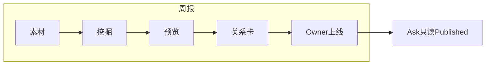

# GeekPark Mesh · 系统与进展汇报

> **日期：** 2026-09-15  
> **读者：** 产品 / 工程同事  
> **镜像（tmesh = prod）：** `geekpark-mesh:2026-09-15-35851230dbab`  
> **本文是什么：** 会前能扫完的汇报——结论、系统怎么跑、关系卡规则、本周交付、下一步。  
> **本文不是什么：** 接口/库表百科（那些看文末外链）。

---

## 一、结论（30 秒）

Mesh 今天做两件事：

1. **周报生产线**：各部门素材 → 挖掘条目 → 生成预览（要点卡 + 关系卡）→ Owner 上线  
2. **已上线语料上的问答**：读者 / Ask / Agent 只读 **Published**，不读草稿

本周主战场是 **预览关系卡质量**（不是 Agent）。三句话：

| 结论 | 含义 |
|------|------|
| **双边 + 共享锚点才成卡** | ≥2 实线队 evidence，且同一公司/人/项目出现在两侧；纯共现硬 skip |
| **读者卡必须有总结 body** | 禁止空 body 糊墙；Verify 不再用字面重合误杀合法 paraphrase |
| **按标签写、Claim 默认 enforce** | Writer 注入 `label_hint`；论断超证据直接丢卡 |

虚线徽章 **不会消失**：真双边卡上仍可出现 `→ 某队`（建议关注）。没了的是「靠虚线凑出来的薄卡」。

---

## 二、系统怎么跑

### 2.1 人点的四步

```
放入素材 → 挖掘（抽 items）→ 生成预览 → Owner 确认上线
```

- 全是人手按钮，**没有按周自动跑**  
- **生成预览**只改 `draft_json`（草稿）；读者页要等 **Publish** 才换成新稿  
- Ask / 飞书问答永远跟已上线语料，不跟预览草稿

### 2.2 点「生成预览」之后

渐进式，避免空窗：

1. 结构性检查 + 合并通过 → 立刻写骨架草稿，**可以先进预览页**  
2. 后台继续：要点卡（可复用）→ 周报壳 → **关系卡**（最慢）  
3. 全部完成 → `_preview_gate_ok`；生成中禁止发布  

进度大致：`跨通道合并…` → `要点卡…` → `正在整理关系卡…` → `完成`

### 2.3 两条链路（总图）



性质：**固定流水线 + 若干次 LLM**。没有 Planner、没有 ReAct。

---

## 三、关系卡主链路（讲解重点）

```
候选（代码）
  → Decision LLM：keep/skip + 17 label + tier + 引用哪些证据
  → Evidence Gate（代码）：证据够不够、锁 teams/sources
  → Writer LLM：只写 title / body / details（带本卡 label_hint）
  → Claim Check：说法强度是否超过证据（prod/tmesh 已 enforce，不合格可藏卡）
  → Verify：details 严 grounding + 按队回填；body 允许 paraphrase，只拦新事实/抄 detail
  → 读者可见：须有非空 body（质量优先）
```

**口诀**

| 阶段 | 负责 |
|------|------|
| Decision | 定「是什么关系」 |
| Gate | 定「证据够不够」 |
| Writer | 定「怎么说人话」 |
| Verify | 定「有没有说飞」 |

### 3.1 当前硬规则（已上线）

1. **成卡**：evidence ≥2 实线队 + **共享锚点**（同一公司/人/项目）；纯共现 / 拼盘主体 → **硬 skip**  
2. **虚线**：可出现在真双边卡上，表示建议关注；**不等于**第二队已有记录  
3. **body**：跨队一句话总结（允许 paraphrase）；写不出则留空且**不上读者页**；禁止抄 details  
4. **Writer**：输入含 `label` + 一行 `label_hint`；禁止「缺证据就写成尚未接触」  
5. **Claim**：默认 enforce；论断强于证据 → 丢卡

### 3.2 字段谁写

| 字段 | 谁定 |
|------|------|
| `label` / `teams` / `evidence` / `decision_tier` | Decision + Gate 锁死 |
| `title` / `body` / `details` | Writer |
| 读者是否看见 | 代码：evidence + title + **非空 body**；非 skip |

---

## 四、本周已交付

| 问题 | 做法 | Commit |
|------|------|--------|
| 关系阶段卡住 / 漏答 candidate | Decision 分批 + 缺 id 重试 | `ac303e6` |
| body 与 details 一字不差 | 禁止 details→body 回填；展示去重；允许空 body | `2190a0c` |
| 单边/海外薄卡难看 | Gate 要求 ≥2 实线团队，不成卡 | `a060f7d` |
| Writer 知 label 不会写 | 按卡注入 `label_hint`；收紧写作契约；标签撞色拆开 | `3585123` |

**环境：** 测试 [tmesh.geekpark.net](https://tmesh.geekpark.net) 与生产 [mesh.geekpark.ai](https://mesh.geekpark.ai) 已对齐 `3585123`。

**验收注意：** 已生成的旧草稿不会自动变干净，需 **重新点一次生成预览** 才按新规则成卡。  
发版 recreate 会打断进行中的预览任务，尽量等跑完再发，或发完清僵尸状态后再点。

---

## 五、下一步

1. **验收**：重跑一期预览——单边是否消失、body/details 是否还重复、语气是否贴 `label_hint`  
2. **可选收尾**：Verify 失败不再塞「第一条 snippet」；发版时自动清僵尸 preview  
3. **Agent / 飞书 Hands**：本汇报不展开；看 `PROJECT_STATUS.md`（该文日期可能仍停在 09-10，以运行镜像为准）

---

## 六、需要时再看

| 需求 | 文档 / 入口 |
|------|-------------|
| 总体架构（含飞书同事长章） | **`MESH_ARCHITECTURE.md`**（§7 飞书同事目标/踩坑/进度） |
| 怎么部署、每周点哪 | `README.md`；`deploy/ship_image.ps1`（先 tmesh 再 prod） |
| 接口 / 库表逐步详解 | `FULL_PIPELINE_DETAIL.md` |
| 轨道看板 / Agent 现状 | `PROJECT_STATUS.md`（可能滞后） |
| 关系代码 | `preview_job.py` → `relation_decision.py` → `relation_writer.py` |
| Writer / Decision 提示词 | `prompts/issue_relation_writer.md`、`issue_relation_decisions.md` |
| 环境可复现 | `ENVIRONMENT_REPRODUCIBILITY.md` |

---

## 附：谁用系统（极简）

| 角色 | 入口 | 做什么 |
|------|------|--------|
| editor | `/admin/issue/{slug}` | 建期、上传、挖掘、生成预览、改草稿 |
| owner | 同一控制台 | 确认上线 |
| viewer | `/{slug}`、Ask | 读已上线周报、提问 |
